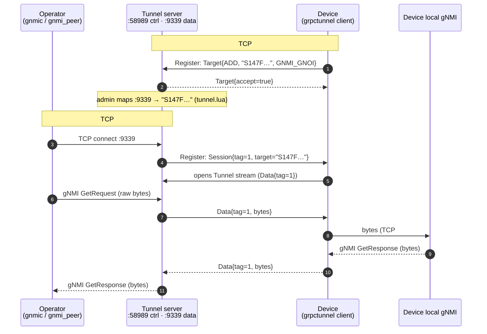
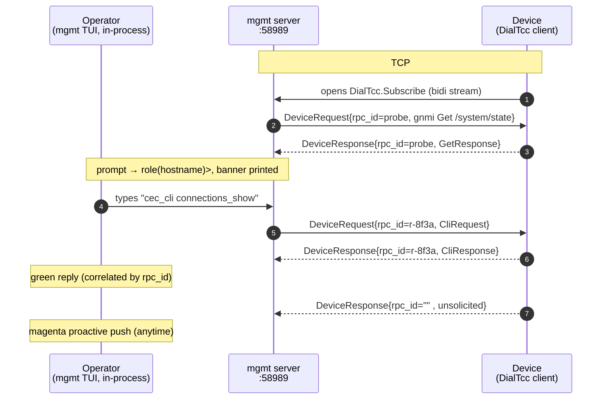

# Dial-out to devices behind NAT — overview

Devices in the field usually can't be reached *inbound* — they sit behind NAT
and firewalls. Instead they **dial out** to a controller. This project provides
two complementary dial-out channels on top of the same hand-rolled
gRPC-over-HTTP/2 stack; both accept a device's outbound connection and let an
operator drive it from the controller side.

| | **grpc-tunnel** | **mgmt bidi dial-out** |
|---|---|---|
| Mode | `app --mode=grpc-tunnel-server` | `app --mode=mgmt-dialout` |
| Proto | openconfig/grpctunnel (`grpctunnel.Tunnel`) | tNMI (`tnmi.DialTcc`) |
| What it carries | a **raw byte stream** (TCP-over-gRPC) | typed **DeviceRequest / DeviceResponse** |
| Reaches | the device's **native gNMI** (Get/Set/Subscribe) | **CLI** + **gNMI**, plus proactive pushes |
| Client | any gNMI client (gnmic, gnmi_peer) at a local port | the built-in command TUI |
| Runbook | [grpc-tunnel-server.md](grpc-tunnel-server.md) | [mgmt-dialout.md](mgmt-dialout.md) |

Both run behind the same server: a device that dials in can Register a tunnel
target, open a mgmt Subscribe stream, and push telemetry — all on one
connection (`connected_client` wires the handlers).

---

## grpc-tunnel — a transparent gNMI pipe

**What it is.** An [openconfig/grpctunnel](https://github.com/openconfig/grpctunnel)
server: a byte proxy that carries an entire TCP/gRPC session *inside* a gRPC
stream. It does **not** parse gNMI — it relays bytes — so the device's real gNMI
(any RPC, any encoding, even end-to-end TLS) rides through untouched.

**Flow.**
```
device ──dials──► server :58989
   Register(stream RegisterOp)   device advertises Target{ADD, name, GNMI_GNOI}
operator connects to  :9339  (a local listener the admin maps to that target)
   server → Session{tag,target} down the device's Register stream
   device opens Tunnel(stream Data{tag})
   operator bytes ⇄ Data{tag} ⇄ device's local gNMI          (transparent)
```
The admin maps `local-port → target` (in `tunnel.lua`); a gNMI client pointed at
that port is talking straight to the device's gNMI. One server can front many
devices — a listener per target.

**Use it when** you want to run standard gNMI (Get/Set/Subscribe) against a
device's own gNMI server as if it were directly reachable.

---

## mgmt bidi dial-out — a command console

**What it is.** The tNMI management channel: a device opens the **bidirectional**
RPC `DialTcc.Subscribe(stream DeviceResponse) returns (stream DeviceRequest)`.
Unlike the byte-proxy, this carries **typed messages** and is *three things at
once*:

1. **Commands down** — the operator sends `DeviceRequest` (a CLI command, or a
   gNMI Get/Set/Subscribe packed into `Any`).
2. **Results up** — the device replies with `DeviceResponse`, correlated to the
   command by a random `rpc_id`.
3. **Proactive pushes up** — the device streams unsolicited `DeviceResponse`s
   (no matching `rpc_id`) for events/telemetry it wants to surface.

**Flow.**
```
device ──dials──► server :58989
   Subscribe stream opens
   server auto-probes gNMI Get /system/state → prompt "role(hostname)>"
operator types a command in the TUI:
   DeviceRequest{rpc_id, device_id, request=Any(CliRequest|gnmi.*)} ──► device
   device runs it, DeviceResponse{rpc_id, response=Any(CliResponse|gnmi.*)} ──► operator
device at any time:
   DeviceResponse (unmatched rpc_id)  ──►  shown as a proactive push
```
Commands are typed in a Claude-style console (or described declaratively in a
`.lua` file and serialized to the proto by reflection — `send <file.lua>`).
`@<device_id>` targets a specific device; `:set cec/json/timeout` are sticky CLI
knobs.

**Use it when** you want to run device **CLI** (e.g. `cec_cli connections_show`),
mix in gNMI, and also watch the device's proactive events — an interactive
operator console rather than a raw gNMI socket.

---

## How they relate

- **Same dial-in, different payload.** grpc-tunnel forwards *bytes* (opaque, any
  protocol); mgmt dial-out exchanges *typed operations* (CLI/gNMI/pushes).
- **gNMI is available on both** — natively over the tunnel, or wrapped in a
  `DeviceRequest` over mgmt dial-out (the device supports both).
- Pick the tunnel for **transparent gNMI tooling**; pick mgmt dial-out for an
  **interactive CLI+gNMI console with proactive telemetry**.

## Sequence flows

### grpc-tunnel — gNMI Get over the tunnel



### mgmt dial-out — command + response + proactive push



## TCP sockets & streams

Both dial-outs are **HTTP/2**, so a single TCP socket is multiplexed into many
independent **streams** (one gRPC call = one stream).

**grpc-tunnel**

| Link | TCP sockets | Streams (per socket) |
|---|---|---|
| Device → Server `:58989` (dial-out) | **1** (HTTP/2) | `Register` (1, long-lived) **+ one `Tunnel` stream per session/tag** (data) + DialTcc `IsAlive` / `PushSubscriptionUpdates` |
| Operator → Server `:9339` | **1 per operator gNMI session** (raw TCP) | opaque — the operator's own gNMI HTTP/2 streams ride *inside*; the tunnel never parses them |
| Device → device-local gNMI | **1 per bridged session** (device-internal) | the real gNMI streams |

So one device = **one** dial-out TCP socket carrying `1 Register + N Tunnel`
streams (N = concurrent operator sessions), each `Tunnel` stream tag-matched to
one `:9339` operator socket, which in turn maps to one device-local gNMI socket.

**mgmt dial-out**

| Link | TCP sockets | Streams (per socket) |
|---|---|---|
| Device → Server `:58989` (dial-out) | **1** (HTTP/2) | **`DialTcc.Subscribe` (1 bidi)** — carries *all* commands, results, and proactive pushes — + `IsAlive` + `PushSubscriptionUpdates` |
| Operator ↔ Server | **0** | the operator is the mgmt TUI **in the same process** (in-memory via `update_sink` / `mgmt_hub`) — no socket |

So mgmt is the simpler shape: **one TCP socket, one long-lived `Subscribe`
stream** does everything (many `DeviceRequest`/`DeviceResponse` messages flow on
that single stream, correlated by `rpc_id`). The tunnel adds a second (and third)
socket because it must bridge an *external* operator to the device's *real* gNMI
socket byte-for-byte.

## Capturing the dial-out (tcpdump)

To debug the dial-out, capture on the **device** (it initiates the connection to
the server). `<server>` is the dial-out server's IP; `58989` is the control/dial
port, `9339` the tunnel data-plane (only if you use the tunnel).

```sh
# Capture the dial-out to a file (Ctrl-C to stop):
tcpdump -i any -n -s 0 -w /tmp/cap.pcap host <server> and port 58989

# Time-bounded — auto-stops after 60s (no Ctrl-C needed):
timeout 60 tcpdump -i any -n -s 0 -w /tmp/cap.pcap host <server> and port 58989

# Packet-count bounded — stops after 2000 packets:
tcpdump -i any -n -s 0 -c 2000 -w /tmp/cap.pcap host <server>

# Include the tunnel gNMI port (:9339) too:
tcpdump -i any -n -s 0 -w /tmp/cap.pcap host <server> and \(port 58989 or port 9339\)
```

Flags: `-i any` all interfaces · `-n` no DNS · `-s 0` full (untruncated) packets ·
`-w` write pcap · `-c` count · `host`/`port` filter to keep it small.

```sh
# Read it back on the device:
tcpdump -r /tmp/cap.pcap -n           # summary
tcpdump -r /tmp/cap.pcap -n -A | less # with ASCII payload
```

Tips: `tcpdump -D` (or `ip -br a`) lists interfaces — capturing on the uplink
(e.g. `-i eth0`) is lighter than `any`. Pull the file off with
`scp /tmp/cap.pcap you@host:` and open it in Wireshark. Traffic is HTTP/2 (gRPC);
if the dial-out is TLS, payloads are encrypted — the pcap still shows the TCP/TLS
handshake, retransmits, RSTs, and timing, which is what dial-out debugging needs.

See the per-feature runbooks for setup, `service.sh` wrappers, TLS, and the TUI.
Both are MIT-licensed (see `LICENSE`).
