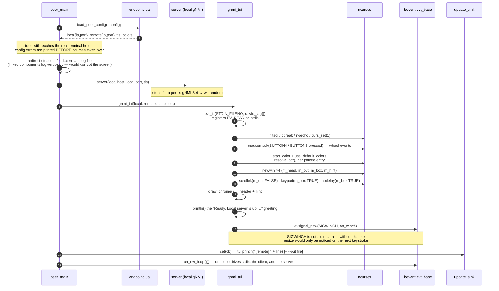
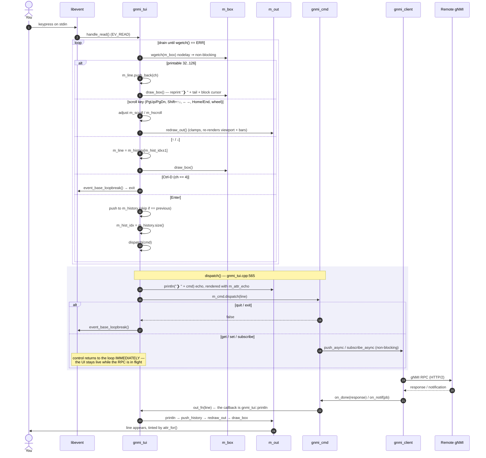
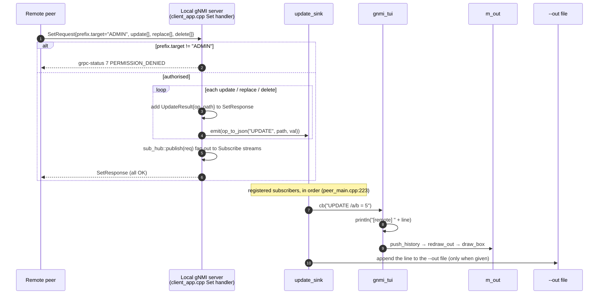
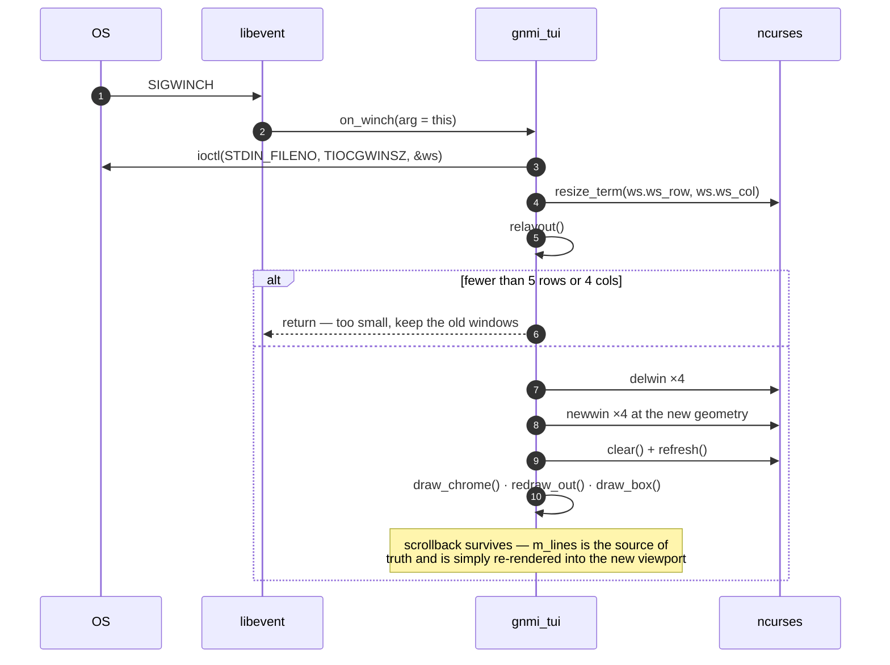

# `gnmi_peer` TUI — windows, input, and how each pane gets filled

The interactive front-end of `gnmi_peer` (`app/peer/src/gnmi_tui.cpp`). It is an
ncurses UI driven entirely from the **shared libevent loop** — there is no input
thread and no blocking `getch()`. The same loop that runs the outgoing gNMI
client and the local gNMI server also delivers keystrokes.

> Historical note: `gnmi-peer-plan.md`, the frozen design record, calls this a
> "two-pane terminal" — you type up top, remote pushes appear below. It was
> never built that way: there are **four ncurses windows**, and remote pushes
> are interleaved into the single transcript, tagged `[remote]`.

---

## Windows

`initscr()` gives one `stdscr`; the TUI carves four sub-windows out of it and
thereafter only touches `stdscr` to blank it — once at startup so the sub-windows
show through, and again on resize. For a terminal of `H` rows × `W` cols:

```
 row 0        ╭─ m_head ─────────────────────────────────────────────╮ 1 row
              │  Marvel gNMI · local :58989 → 127.0.0.1:58990        │  A_DIM
              ╰──────────────────────────────────────────────────────╯
 rows 1       ╭─ m_out ──────────────────────────────────────────────╮ H-5 rows
   ..H-5      │ ❯ gnmi get /system/state                          ░ │  transcript
              │ [get] OK, 1 notification(s)                       █ │  viewport
              │   {"/system/state/hostname": "dev1"}              █ │  + scrollbars
              │ [remote] UPDATE /a/b = 5                          ░ │
              │ ─────────────▄▄▄▄▄▄▄▄▄▄▄▄─────────────────────────  │  ← h-scrollbar
              ╰──────────────────────────────────────────────────────╯     ↑ v-scrollbar
 rows H-4     ╭─ m_box ──────────────────────────────────────────────╮ 3 rows
   ..H-2      │ ╭──────────────────────────────────────────────────╮ │  rounded border
              │ │ ❯ gnmi set /a/b:5▉                               │ │  prompt + cursor
              │ ╰──────────────────────────────────────────────────╯ │
              ╰──────────────────────────────────────────────────────╯
 row H-1      ╭─ m_hint ─────────────────────────────────────────────╮ 1 row
              │   set · get · help · quit · ↑↓ history · …           │  A_DIM
              ╰──────────────────────────────────────────────────────╯
```

| Window | Geometry | Contents | Drawn by |
|---|---|---|---|
| `m_head` | `newwin(1, W, 0, 0)` | endpoints + `(TLS)` marker, dimmed | `draw_chrome()` — once, and on resize |
| `m_out` | `newwin(H-5, W, 1, 0)` | scrolling transcript + both scrollbars | `redraw_out()` — on every new line, scroll, resize |
| `m_box` | `newwin(3, W, H-4, 0)` | rounded border, `❯ ` prompt, current input line, block cursor | `draw_box()` — on every keystroke |
| `m_hint` | `newwin(1, W, H-1, 0)` | key hints, dimmed | `draw_chrome()` |

The row budget is `1 + (H-5) + 3 + 1 = H`. `out_h` is floored at 1, and
`relayout()` bails out entirely below `H < 5 || W < 4`.

### Inside `m_out`

`m_out` is not an auto-scrolling curses pad — `scrollok(m_out, FALSE)`. It is a
**viewport rendered from scratch** each time, out of the `m_lines` deque:

- text rows: `view_h = out_h - 1` (the last row is the horizontal scrollbar)
- text cols: `text_w = W - 1` when the vertical scrollbar is shown, else `W`
- vertical scrollbar: last column, `█` thumb on `░` track, only when
  `total > view_h`; thumb height ∝ `view_h² / total`
- horizontal scrollbar: bottom row, `▄` thumb on `─` track; thumb width ∝
  `text_w² / maxw`, where `maxw` is the widest *currently visible* line

Scroll state is two integers: `m_scroll` (offset from the bottom; `0` = pinned to
newest) and `m_hscroll` (column offset). Both are clamped inside `redraw_out()`,
so callers can move them freely and let the renderer fix them up. The top visible
line is `first = total - view_h - m_scroll`.

Horizontal panning uses `utf8_window()`, which slices by **display column** and
never splits a multibyte sequence — important because the transcript is full of
`·`, `─`, `❯`, and JSON with UTF-8 values.

---

## Startup



Note the ordering constraint: config is loaded *before* `initscr()` so a bad
`endpoint.lua` prints a readable error instead of vanishing behind the curses
screen, and `std::cout`/`std::cerr` are re-pointed at the logfile *after* that
but before the loop starts. ncurses keeps fd 1; only the C++ streams move.

---

## Keystroke → command → transcript

`gnmi_tui` derives from `evt_io` on `STDIN_FILENO` via the `rawfd_tag` ctor, so
libevent calls `handle_read()` whenever stdin is readable. Because
`nodelay(m_box, TRUE)` is set, `wgetch()` never blocks: the handler **drains all
queued keys** until it returns `ERR`, then returns to the loop.



The whole UI is single-threaded and reentrancy-free: the RPC callback runs on the
same loop thread as `handle_read`, so `println()` can touch ncurses state without
locking. A `subscribe` simply keeps calling `on_notif` → `println` for as long as
the stream lives, with the input box still accepting keys between notifications.

---

## The other producer — remote pushes

The transcript has **two independent writers**. Command results are one; the
other is `update_sink`, fed by the *local* gNMI server that `peer_main` starts on
`local.endpoint`. When a remote peer sends us a `SetRequest`, the Set handler
reflects each operation into the sink, and the TUI renders it prefixed
`[remote]`.



`update_sink` is a no-op singleton when nothing registers (the `app` and
`cli_app` binaries), which is why the same Set handler serves all three.

**Under the grpc-tunnel topology this path is dormant.** The tunnel only carries
connections the *server* initiates toward the device, so a NATed device cannot
reach back into the peer's local gNMI server. That is why
`docs/tunnel/peer.lua` marks its `local` endpoint "unused here". You will see
`[remote]` lines in the true peer-to-peer setup, not over the tunnel.

---

## How `println()` fills the transcript

```
println(line)
  └─ split on '\n'  (a multi-line message becomes N transcript lines)
       └─ push_history(part)     m_lines.push_back; cap 5000, pop_front oldest
  └─ if m_scroll > 0:  m_scroll += added      ← keep a scrolled-back view anchored
  └─ redraw_out()                             ← clamp, slice, render, scrollbars
  └─ draw_box()                               ← put the cursor back in the input box
```

That `m_scroll += added` is the detail that makes scrollback usable under a live
`subscribe`: if you have scrolled up to read something, incoming notifications
push the buffer down *underneath* you rather than yanking the view to the bottom.
Press `End` (`m_scroll = 0`) to resume following.

---

## Line colouring

`redraw_out()` calls `attr_for(line)`, which classifies purely by leading tag —
no metadata travels with the line:

| Match | Attribute | Configurable |
|---|---|---|
| starts `❯` | `m_attr_echo` (default `dim`) | `colors.echo` |
| starts `[remote]` | `m_attr_remote` (default `cyan`) | `colors.remote` |
| starts `[notif ` or `[sub]` | `m_attr_sub` (magenta) | hardcoded |
| starts `[set]` | `m_attr_set` (green) | hardcoded |
| starts `[get]` | `m_attr_get` (cyan) | hardcoded |
| first non-space char is `{` | `m_attr_get` — bare JSON leaf lines from a Get | hardcoded |
| contains `error` / `denied` / `FAIL`, or starts `unknown command` / `usage` / `no valid` / `  skip` | `m_attr_warn` (default `amber`) | `colors.error` |
| anything else | terminal default | — |

Colours are foreground-only on the terminal's own background
(`use_default_colors()`, `init_pair(pair, fg, -1)`), so the UI inherits your
theme instead of painting blocks of colour. If the terminal has no colour,
`resolve_attr()` degrades to `dim`/`bold` only.

`colors.ok` is *not* a transcript category — it tints the `❯` glyph inside the
input box (`draw_box`). Echoed commands in the transcript use `colors.echo`.

---

## Keys

| Key | Action |
|---|---|
| printable | append to `m_line`, redraw box |
| `Backspace` / `Del` | pop last byte of `m_line` |
| `Enter` | echo, record in history, `gnmi_cmd::dispatch` |
| `↑` / `↓` | recall previous / next command (past the newest clears the line) |
| `←` / `→` | pan the transcript horizontally by 8 columns |
| `PgUp` / `PgDn` | scroll a page — `out_h - 1` lines, i.e. exactly one text viewport |
| `Shift+↑` / `Shift+↓` | scroll one line (`KEY_SR` / `KEY_SF`) |
| `Home` / `End` | jump to oldest buffered line / newest (resume follow) |
| wheel up / down | scroll 3 lines (`BUTTON4` / `BUTTON5`) |
| `Ctrl-D` | `event_base_loopbreak()` → exit |
| `quit` / `exit` | `gnmi_cmd::dispatch` returns false → loop breaks |

History dedupes only *consecutive* repeats, and `m_hist_idx == m_history.size()`
means "editing a fresh line".

---

## Resize

`SIGWINCH` is a signal, not stdin data, so it is registered on the libevent base
as `evsignal_new(...)` rather than relying on ncurses' `KEY_RESIZE` (which would
only surface on the next keystroke). `KEY_RESIZE` is *also* handled in
`handle_read` as a belt-and-braces path.



Windows are destroyed and recreated rather than `wresize`/`mvwin`'d — simpler,
and always correct regardless of whether the terminal grew or shrank.

---

## Why the block cursor

`draw_box()` paints a reverse-video space at the insertion point on top of
`curs_set(1)`. Under tmux and MobaXterm the real terminal cursor frequently does
not blink inside a curses sub-window, leaving no visible caret. The drawn cell
guarantees one.

Long input lines scroll rather than wrap: `draw_box()` shows only the trailing
`bw - 6` bytes of `m_line`.
