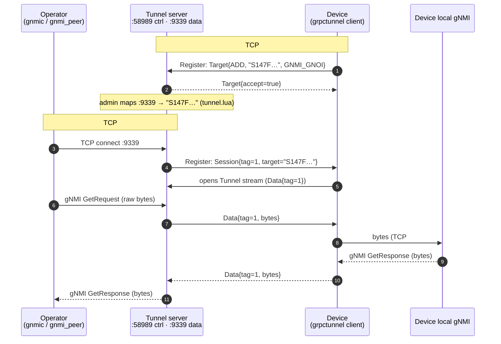
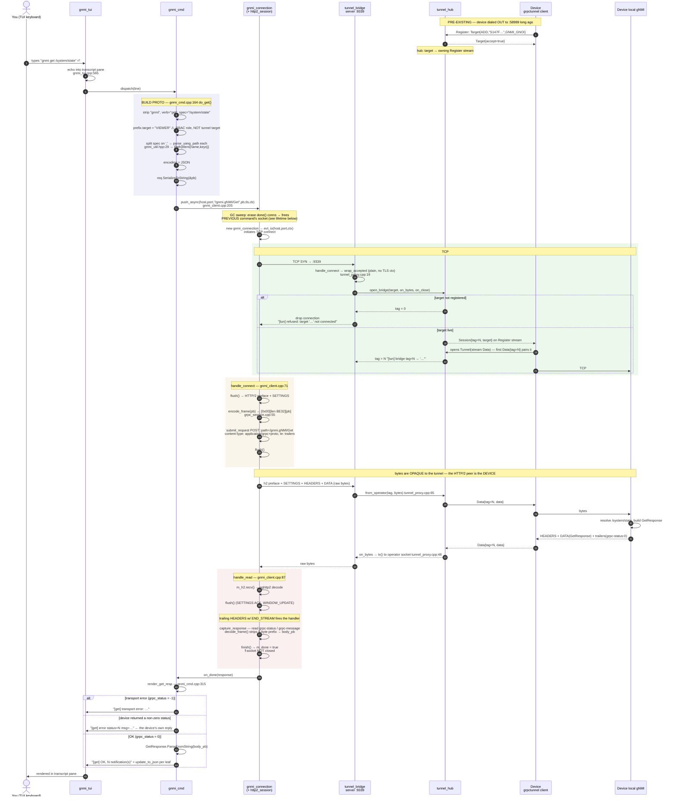
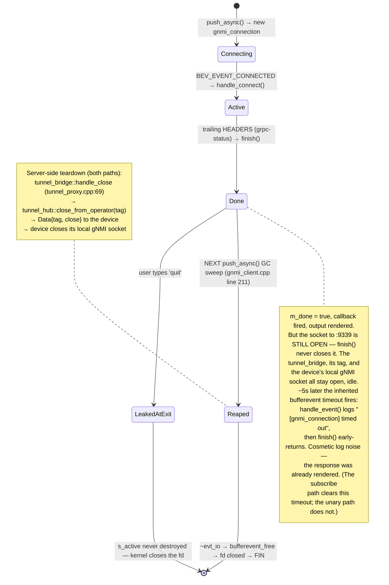

# gRPC tunnel server — openconfig/grpctunnel (reach devices behind NAT)

`app --mode=grpc-tunnel-server` is an **openconfig/grpctunnel** server. A device
behind NAT runs a grpctunnel **client**, dials OUT to this server, and Registers
the services it fronts (e.g. a `GNMI_GNOI` target). The server can then open a
data tunnel to that target and byte-proxy a connection to it.

grpctunnel is a **TCP-over-gRPC byte proxy** — it forwards raw bytes, it does not
parse gNMI. A gNMI session to a NATed device is tunnelled as an opaque byte
stream.

The proto is vendored verbatim at `app/idl/tunnel/tunnel.proto` (package
`grpctunnel`, version 0.2) — the wire format the device speaks.

---

## The protocol

```proto
service Tunnel {
  rpc Register(stream RegisterOp) returns (stream RegisterOp);  // control
  rpc Tunnel(stream Data)         returns (stream Data);        // data (bytes)
}
```

- **Register** — the client advertises `Target{op=ADD, target, target_type}`; the
  server acks (`accept=true`). To reach a target the server sends
  `Session{tag, target}`; both sides then open a **Tunnel** stream for that tag.
- **Tunnel** — `Data{tag, data, close}` carries the raw bytes of the proxied
  connection, multiplexed by tag.

---

## Topology

```
  Device (behind NAT)                         Server (reachable)
   grpctunnel client                          app --mode=grpc-tunnel-server
        │  Register ──► Target{ADD, GNMI_GNOI} │
        │  ◄── Target{accept}                  │   monitor TUI lists targets
        │                                      │
        │  (Increment B: Session{tag} ◄──────  │   ◄── operator connects
        │   Tunnel Data{tag} bytes ◄─────────► │       to a local gNMI listener
        │   → device's local gNMI :9339        │       bytes proxied over Tunnel
```

`endpoint.lua` is not used — CLI-flag configured, like `--mode=gnmi-server`.

### Sequence flow — gNMI Get over the tunnel



**TCP/streams:** one device dial-out socket (`:58989`, HTTP/2) carries
`1 Register + N Tunnel` streams (one `Tunnel` per operator session/tag); each
operator `:9339` connection is a separate raw TCP socket relayed byte-for-byte to
the device's real gNMI socket. Full breakdown:
[dialout-overview.md](dialout-overview.md#tcp-sockets--streams).

### Detailed flow — inside `gnmi_peer`

The diagram above stops at the tunnel boundary. This one follows a single
`gnmi get /system/state`, typed in the TUI, all the way to the device and back —
naming the code that performs each step.



Two details this makes visible:

- **`prefix.target = "VIEWER"` is set during proto-build, long before the tunnel
  is involved.** It is this repo's own gNMI server's RBAC role (Get ⇒ `VIEWER`,
  Set ⇒ `ADMIN`), hardcoded in `gnmi_cmd.cpp` with no CLI override. Over the
  tunnel it rides through the byte pipe untouched and is interpreted by the
  *device*, which may reject it or scope the request to a nonexistent target.
  `gnmic` sends no prefix target by default — that difference explains most
  "works with gnmic, fails with gnmi_peer" `status=3` reports.
- **`finish()` does not close the socket.** See below.

For the front-end half of this picture — the four ncurses windows, how keystrokes
reach `dispatch()` off the libevent loop, and how each pane gets filled — see
[gnmi-peer-tui.md](gnmi-peer-tui.md).

### Client connection lifetime

`finish()` marks the exchange done and fires the render callback; the TCP
connection to `:9339` stays open until the *next* command's GC sweep reaps it.



So command N's socket, tunnel tag, and device-side gNMI connection close when you
type command N+1 — there is **no connection reuse** across commands, and each one
opens a fresh TCP connection, HTTP/2 preface, and tag. The last command's socket
is never closed by the program: `s_active` is deliberately never destroyed
(`gnmi_client.cpp:199`) to avoid a static-destruction-order crash where a
bufferevent outlives the event base. On exit the kernel closes the fd, the tunnel
sees EOF, and the bridge cleans up.

---

## Status

**Increment A (done): Register.** The server accepts `Register`, records
`Target{ADD}`/drops `Target{REMOVE}`, acks, and lists live targets in a monitor
TUI. Run interactively for the dashboard; `--headless=true` for log-only.

**Increment B (done): Tunnel data plane.** A local gNMI listener (`--local-port`,
`--target`) byte-proxies operator connections to a registered target: on accept
the server sends `Session{tag}` on the target's Register stream; the device opens
`Tunnel(stream Data)`; the first `Data{tag}` pairs the stream and bytes relay
both ways (operator socket ⇄ `Data{tag}` ⇄ device's local gNMI). The listener is
raw TCP, so operator-side TLS (if any) is tunnelled end-to-end to the device.

---

## Architecture (reused transport)

- **Bidi transport** — Register and Tunnel are both bidi. `http2_session` fires a
  headers-received hook so `grpc_session::register_bidi_stream()` opens the
  response as the stream opens (a dial-out client never half-closes); incoming
  frames reuse the client-streaming decode path, outgoing use the
  server-streaming send path.
- **`tunnel_hub`** — registry of registered targets (id → owning Register stream
  + type + since), cleaned up when a Register stream closes.
- **`tunnel_tui`** — the monitor: a targets pane (id / type / uptime) over a
  scrolling event transcript (scrollback + scrollbar + resize), 1s uptime tick.

---

## Run

```bash
cd hackthon
./build.sh -t gnmiserver:dev

# monitor TUI (interactive):
./run.sh --image gnmiserver:dev grpc-tunnel-server
# or plain / headless, with the data-plane listener enabled:
docker run -d --name tunnel -p 58989:58989 -p 9339:9339 \
  gnmiserver:dev /app/app --mode=grpc-tunnel-server --port=58989 --headless=true \
    --local-port=9339 --target=dev1
# TLS: add --tls=true --cert=… --key=…  (no --ca ⇒ one-way TLS, no client cert)
```

With `--local-port=9339 --target=dev1`, point a gNMI client at the server's
`:9339` and its traffic is byte-proxied to `dev1`'s local gNMI over the tunnel.

Headless logs (also shown in the TUI transcript):
```
[reg] Register stream opened (stream=…)
[reg] +target 'dev1' (GNMI_GNOI) — 1 total
```

## Target selection

Routing keys off the **target name the device publishes** in its `Register`
(`Target{ADD, target, target_type}`). The name is the device's choice and opaque
to the server — often a pipe-delimited descriptor like
`<serial>|<model>|grpc-tunnel|<sw-version>`.

- The device is the **authority** on target names; the server stores them in
  `tunnel_hub`, each owned by the connection that ADDed it.
- To reach a target the server sends `Session{tag, target}` down **that
  connection's** Register stream; the device uses `target`/`target_type` to
  choose which local service to bridge to.
- A local listener is bound to **one** target via `--target` (exact string
  match). Client → `:9339` ⇒ that one target. A wrong/absent name is refused
  (`[tun] refused: target '…' not connected`).
- If the device disconnects, its targets are dropped
  (`[reg] -target '…' (disconnected)`) until it re-registers.

For several devices behind one server, map **one local port per target** in a
config file (`--config`). The port is the *admin's* choice — the device never
asks for a port, it only publishes a target name; you decide which local port
fronts it. Example `docs/tunnel.lua`:

```lua
return {
  port = 58989,                                   -- control/tunnel port
  tls  = { enabled = false },
  listeners = {                                   -- "port" -> published target
    ["9339"] = "<device-A published target>",
    ["9340"] = "<device-B published target>",
  },
}
```
```bash
docker run -d -p 58989:58989 -p 9339:9339 -p 9340:9340 \
  -v "$PWD/tunnel.lua:/app/tunnel.lua:ro" \
  marvel:dev /app/app --mode=grpc-tunnel-server --headless=true \
    --config=/app/tunnel.lua
```
Then `:9339` reaches device A, `:9340` reaches device B — each a transparent
gNMI pipe. (Alternatively, extend it to pick the target from client metadata
such as SNI — not done yet.)

## Using it — gNMI over the tunnel

The local listener is a transparent byte pipe, so **any gNMI client** works, and
**all of Get/Set/Subscribe** ride through unchanged. You do NOT set a
target/prefix on the client — `:9339` *is* the device.

**gnmic:**
```bash
gnmic -a <server>:9339 --insecure capabilities              # simplest check
gnmic -a <server>:9339 --insecure get --path /system/state
gnmic -a <server>:9339 --insecure subscribe --path /…
```

**gnmi_peer** (this repo's tool) — point its `remote` at the listener:
```lua
-- endpoint.lua
return {
  ["local"]  = { endpoint = { ip = "0.0.0.0",   port = 58989 } },
  ["remote"] = { endpoint = { ip = "<server>",  port = 9339  } },  -- the tunnel listener
  tls = { enabled = false },
}
```
```bash
./run.sh --config ./endpoint.lua gnmi-cli
# then: gnmi get /system/state   |   gnmi set /a/b:5   |   gnmi subscribe /…
```

Note: `--insecure` / `tls.enabled=false` means **plaintext** gNMI to the device;
if the device's *local* gNMI is TLS, give the client TLS args instead — that TLS
is end-to-end to the device (the tunnel only relays bytes), independent of the
tunnel's own control-channel TLS.

### Which IP does the client use?

The client connects to the **tunnel server's** `--local-port`, **not** the
device. So `<server>` is the host/IP where the server published `:9339` (e.g.
`10.0.60.110:9339`) — the server relays onward to the device over the tunnel.
From another container, use the host's LAN IP (`127.0.0.1` inside a container is
that container itself, not the host).

### Worked example

Terminal 1 — the tunnel server on host `10.0.60.110`; the device has dialed in
and published a target:
```
$ docker run --rm -p 10.0.60.110:58989:58989 -p 10.0.60.110:9339:9339 \
    marvel:dev /app/app --mode=grpc-tunnel-server \
      --local-port=9339 --target='<published-target>'
[main] mode=grpc-tunnel-server port=58989 tls=OFF local=:9339 target=<published-target>
[reg] Register stream opened (stream=1)
[reg] +target '<published-target>' (GNMI_GNOI) — 1 total
```

Terminal 2 — a gNMI client pointed at the **server's** `:9339` (not the device):
```
$ gnmic -a 10.0.60.110:9339 --insecure get --path /system/state/hostname
# → the device's gNMI response, byte-proxied back through the tunnel
```

Back in Terminal 1, the client connect drives the data plane:
```
[tun] bridge tag=1 → '<published-target>'     ← client connected → Session{tag} sent to device
[tun] Tunnel stream opened (stream=5)          ← device opened Tunnel(tag); bytes now relay
```
If `[tun] bridge tag=…` is missing, `--target` didn't match the published name
exactly (it is often long, with spaces and `|` — quote it).

## One-command stack (`service.sh`)

`service.sh` wraps `docs/docker-compose.tunnel.yml` (docker or podman compose)
to run the tunnel + gnmi_peer together, so an end user does gNMI without
touching the internals:

```bash
# 1. set your device's published target in docs/tunnel.lua (listeners["9339"])
./service.sh grpc-tunnel                       # builds marvel:dev if needed, starts both services
./service.sh logs | grep '+target'    # confirm the device registered
```

Then drive gNMI either interactively or one-shot (scriptable):
```bash
./service.sh attach                   # interactive shell: gnmi get/set/subscribe
# — or one-shot over the tunnel —
./service.sh get /system/state
./service.sh set /interfaces/interface[name=eth0]/config/enabled:true
./service.sh subscribe /interfaces 10s # SAMPLE every 10s (omit interval => on-change); Ctrl-C to stop
```
`./service.sh stop` tears it down; `ps`, `restart`, `build`, `--help` also exist.
The one-shot commands run an ephemeral gnmi_peer against `tunnel:9339` — the
stack must be `up` first so the device is registered. For several devices, add
ports to `tunnel.lua` and run a peer per target.

In the attached `gnmi_peer` console: `↑`/`↓` recall command history, `Shift+↑`/
`Shift+↓` scroll one line, `PgUp`/`PgDn`/`Home`/`End` scroll pages, and `←`/`→`
scroll horizontally for wide output (a bottom h-scrollbar shows the position).

> **Keys under tmux:** the console runs with `TERM=xterm-256color`, so `PgUp`/`PgDn`,
> `Home`/`End`, `←`/`→` (horizontal scroll) and `↑`/`↓` (history) pass straight
> through. Two gotchas: **(1)** if the top-right shows `[N/M]` you're in tmux
> **copy-mode** — press `q` to exit, otherwise the arrows scroll tmux, not the
> console; **(2)** tap the arrow directly — pressing the tmux **prefix** (`Ctrl-B`)
> first turns it into a tmux command. `Shift+↑`/`Shift+↓` (one-line scroll) also
> need `set -g xterm-keys on` in `~/.tmux.conf` (default on in tmux ≥ 2.4); the
> plain arrows don't.

## Troubleshooting

| Symptom | Cause & fix |
|---|---|
| peer: `transport error: connection closed before response`; tunnel: `[tun] refused: target '…' not connected` | The listener's target isn't registered. Either the device isn't dialed in (**no `[reg] +target`** in the log — see below), **or** the `tunnel.lua`/`--target` name doesn't match. The name must equal the device's published `[reg] +target '…'` **character-for-character** (it can contain spaces and `|`) — copy it straight from the log. |
| No `[reg] +target '…'` ever appears | The device isn't reaching `:58989`. Confirm it's dialing this host in **plaintext** (`tls=OFF`). A `-903` / `[tls] handshake error` means the device is doing **mTLS** against a plaintext tunnel — enable TLS in `tunnel.lua` + mount certs, or point the device at plaintext. Re-trigger the device's dial-out if it dropped (e.g. after the server was restarted). |
| `gnmi subscribe /x` dumps state once then goes quiet | That's `TARGET_DEFINED` (no interval). For periodic updates add a **SAMPLE interval**: `gnmi subscribe /x 10s`. Omit it and the device decides (usually on-change). |
| `gnmi get /x → error status=3 …` (e.g. "empty after filtering with sensor:…") | This is the **device's own gNMI response**, round-tripped cleanly through the tunnel — not a tunnel fault. Try a narrower leaf, or subscribe instead; some subtrees are only served on-change/sample. |
| compose: `all predefined address pools have been fully subnetted` | Too many Docker networks on the host. `docker network prune -f`, then `./service.sh grpc-tunnel`. Or expand `default-address-pools` in `/etc/docker/daemon.json`. |

The golden rule: **`gnmi get`/`set`/`subscribe` only work once `[reg] +target '…'` is in the tunnel log and the listener target matches it exactly.**

## Smoke test (no device)

`docs/tunnel-smoke.sh` uses grpcurl to open `Register` and send
`Target{op:ADD, target_type:GNMI_GNOI}`, asserting the server acks and logs the
target. See that script's header for usage.
