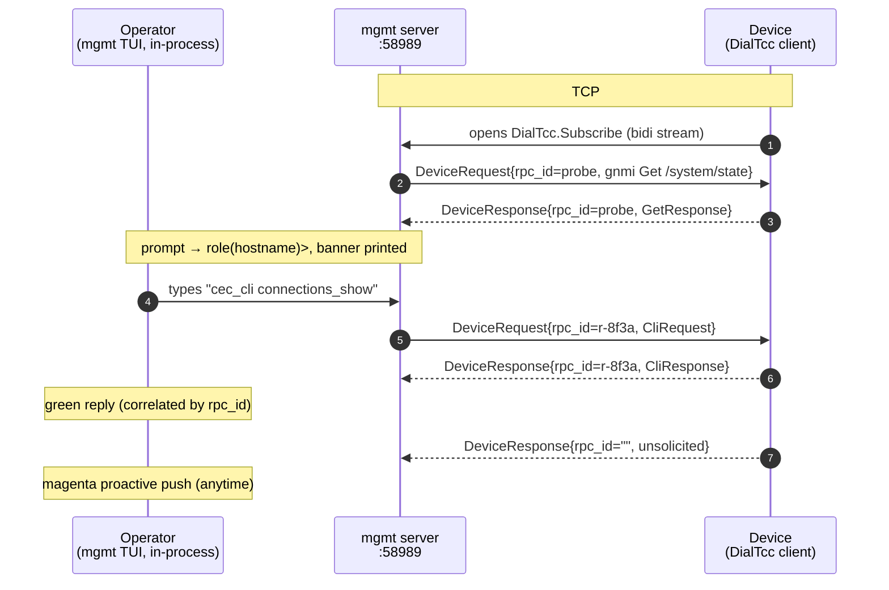
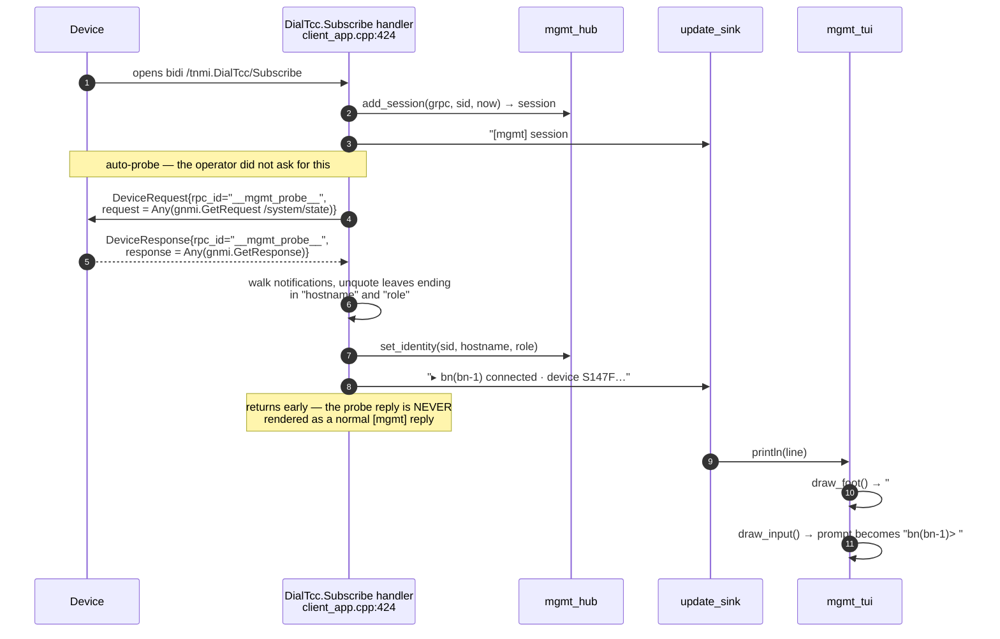
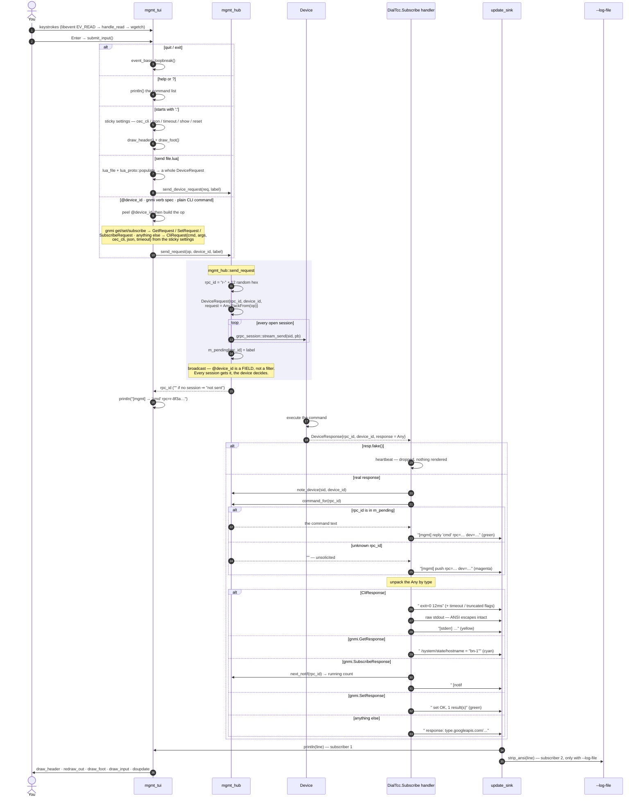

# tNMI mgmt dial-out

A bidirectional management channel for devices behind NAT. A device dials in and
opens the bidi RPC **`/tnmi.DialTcc/Subscribe`**:

```
device ──dials──► server :58989
        Subscribe(stream DeviceResponse) returns (stream DeviceRequest)
   operator ──DeviceRequest (command) ──► device        (down)
   device   ──DeviceResponse (result / proactive push)─► operator  (up)
```

You type a request in the console; it is packed into a `DeviceRequest` with a
random `rpc_id` and sent to every connected device. Each `DeviceResponse` is
correlated back to its command by `rpc_id` — an unmatched one is an unsolicited
(proactive) push; a `fake=true` heartbeat is ignored.

Supported request types (packed into `DeviceRequest.request`):
- **CLI** — `CliRequest{cmd, args, cec_cli, json, timeout}`
- **gNMI** — `gnmi.GetRequest` / `SetRequest` / `SubscribeRequest`

(The vendored proto is a CLI+gNMI-focused subset of upstream `tnmi_dialout.proto`
at `app/idl/dialout/tnmi_dialout.proto`, package `tnmi`.)

## Sequence flow



**TCP/streams:** a single device dial-out socket (`:58989`, HTTP/2) carries **one
long-lived `DialTcc.Subscribe` stream** that carries *all* commands, results, and
proactive pushes (plus `IsAlive` / `PushSubscriptionUpdates`). There is **no
operator socket** — the mgmt TUI runs inside the server process. Full breakdown:
[dialout-overview.md](dialout-overview.md#tcp-sockets--streams).

## Run it

Easiest — the wrapper (builds `marvel:dev` if needed, single-container TUI). It
mounts `docs/mgmt-requests` at `/req` and forces `TERM=xterm-256color` (so keys
work under tmux):
```bash
./service.sh mgmt                              # command TUI on :58989
./service.sh mgmt --out-file ./logs/mgmt.txt   # + save every response to a file
./service.sh mgmt --req-dir ./my-requests      # mount a request-.lua dir at /req
./service.sh mgmt --no-attach                  # leave it detached (scripts/CI)
```

`--no-attach` exists because attaching with a closed stdin (`< /dev/null`, a
pipeline, cron) sends `^D` to the TUI and quits it. Scripts should start the
container detached and, if they need a transcript, pass `--out-file`; attach
later with `./service.sh attach` when a human wants to type. See
[capturing a long run](#capturing-a-long-run).
Or directly:
```bash
docker run -it --rm -e TERM=xterm-256color -p 58989:58989 \
  marvel:dev /app/app --mode=mgmt-dialout
#   --tls=true --cert/--key/--ca   TLS
#   --log-file=<path>              append every response to a file
#   --headless=true                stdout instead of the TUI
```
Under tmux, force `TERM=xterm-256color` as shown (tmux's `screen`/`tmux-256color`
may be missing from the container's terminfo, which breaks PgUp/Home/wheel).

Wait for a device to dial in — the sessions pane shows `#1`, and the transcript
logs `[mgmt] session #1 opened`.

## The console (TUI)

A full-height transcript with a compact bottom (session line + input box):
```
 Marvel gNMI Mgmt · :58989 · 1 session(s)      PgUp/PgDn·End scroll · ^D quit  ← header
 ▸ bn(S147F2223907369) connected · device S147F2223907369                      ← transcript
 [mgmt] → gnmi get /system/state  rpc=r-8f3a…                                     (fills the
     /system/state/hostname = "bn-1"  …                                          whole area)
 #1 bn(S147F2223907369)  3m      · defaults                                    ← session + settings
 ╭────────────────────────────────────────────╮
 │ bn(S147F2223907369)> gnmi get /system/state │                               ← Claude-style box
 ╰────────────────────────────────────────────╯
```
Same UI family as the other TUIs: the grpc-tunnel monitor colours/chrome plus the
gnmi_peer's **Claude-style rounded input box**. There's no top pane — the
transcript fills the height; the session summary (`#id role(hostname) uptime`)
and sticky settings sit in the footer next to the box.

- On session-open the server auto-probes `gnmi Get /system/state` and prints a
  **banner** (`▸ role(hostname) connected …`); the **prompt** becomes
  `role(hostname)> `.
- **Keys:** `Up`/`Down` recall command history; scroll vertically with
  **`Shift+↑`/`Shift+↓` (one line)**, `PgUp`/`PgDn` (page), `Home`/`End`
  (top/bottom), or the mouse wheel; **`←`/`→` scroll horizontally** for wide
  output (a bottom h-scrollbar shows the position); `help` (or `?`) lists
  commands; `quit`/`exit`/`^D` leaves.
- Colours: cyan `[mgmt]` headers, green replies, magenta proactive pushes, yellow
  errors.

> **Keys under tmux:** the console runs with `TERM=xterm-256color`, so `PgUp`/`PgDn`,
> `Home`/`End`, `←`/`→` (horizontal scroll) and `↑`/`↓` (history) pass straight
> through. Two gotchas: **(1)** if the top-right shows `[N/M]` you're in tmux
> **copy-mode** — press `q` to exit, otherwise the arrows scroll tmux, not the
> console; **(2)** tap the arrow directly — pressing the tmux **prefix** (`Ctrl-B`)
> first turns it into a tmux command. `Shift+↑`/`Shift+↓` (one-line scroll) also
> need `set -g xterm-keys on` in `~/.tmux.conf` (default on in tmux ≥ 2.4); the
> plain arrows don't.

### Windows

`mgmt_tui::relayout()` creates **four** ncurses windows out of `stdscr`. For a
terminal of `H` rows × `W` cols:

| Window | Geometry | Contents | Redrawn by |
|---|---|---|---|
| `m_head` | `newwin(1, W, 0, 0)` | `Marvel gNMI Mgmt · :58989 · N session(s)` + key hints, dimmed | `draw_header()` — on every line, `:set`, and the 1s tick |
| `m_out` | `newwin(H-5, W, 1, 0)` | full-height transcript + both scrollbars; interprets device ANSI colour | `redraw_out()` |
| `m_foot` | `newwin(1, W, H-4, 0)` | `#1 role(hostname) 3m · defaults` — sessions + sticky settings | `draw_foot()` — on every line and the 1s tick |
| `m_inp` | `newwin(3, W, H-3, 0)` | rounded box, `role(hostname)> ` prompt, block cursor | `draw_input()` — on every keystroke |

Row budget: `1 + (H-5) + 1 + 3 = H`. `relayout()` bails below `H < 7 || W < 10`.

Two vestigial members survive from the earlier grpc-tunnel-style layout:
`m_sessions` and `m_sep`. They are declared, destroyed in the dtor, and have
`draw_sessions()` / `draw_sep()` implementations — but `relayout()` never
creates them and nothing ever calls those functions. The session table moved
into `m_foot`. Both draw functions early-return on the null window, so the dead
code is harmless, just misleading. The `mgmt_tui.hpp` header comment still
depicts the old `SESSION / UPTIME` pane.

Differences from the `gnmi_peer` TUI ([gnmi-peer-tui.md](gnmi-peer-tui.md)):
scrollback is capped at **200 000** lines rather than 5 000; a **1-second
libevent timer** (`on_tick`) repaints the header/footer so session uptime
advances without input; and `draw_ansi_line()` parses embedded **ANSI SGR**
escapes so a device's coloured CLI output (`:set cec_cli on`) renders in colour
inside the transcript.

### Session open — the identity probe

The prompt and banner are not configured; they come from a gNMI Get the server
fires automatically the moment a device opens the stream.



`draw_input()` reads the prompt from the **first identified session** in
`mgmt_hub::snapshot()`, falling back to `hostname> `, `role> `, and finally the
bare `❯ ` before the probe answers.

### A command round-trip



Three things this makes explicit:

- **`rpc_id` is the only correlation.** `mgmt_hub` remembers `rpc_id → command
  text` in `m_pending`. A `DeviceResponse` whose `rpc_id` is unknown is by
  definition a **proactive push** and is coloured magenta. Nothing else
  distinguishes the two — a reply to a command you sent before a restart would
  render as a push.
- **Commands are broadcast to every open session.** `send_request()` loops over
  all sessions and calls `stream_send` on each. A leading `@<device_id>` only
  sets `DeviceRequest.device_id`; honouring it is the *device's* job. With two
  devices connected, both receive every command.
- **`m_pending` never shrinks.** Entries are added per command and only read, so
  a long-lived console accumulates one map entry per command issued. Same for
  `m_notif` (per-`rpc_id` notification counters). Fine at human typing rates.

### Rendering

`println()` fans one message into the transcript exactly like the peer TUI, but
repaints more:

```
println(line)
  └─ split on '\n' → push_history(part)   deque, capped at 200 000, pop_front
  └─ if m_scroll > 0:  m_scroll += added   ← hold the view when scrolled up
  └─ draw_header()   session count may have changed
  └─ redraw_out()    viewport + v/h scrollbars + ANSI SGR per line
  └─ draw_foot()     session summary + sticky settings
  └─ draw_input()    put the caret back in the box
  └─ doupdate()      one atomic screen update
```

Line colour comes from `attr_for()`, matched on the leading tag:

| Match | Colour |
|---|---|
| contains `unparsable`, `[stderr]`, or `not sent` | yellow (warn) |
| starts `[mgmt] reply` | green |
| starts `[mgmt] push` | magenta |
| starts `[mgmt]` | cyan (header) |
| starts `    [notif ` | magenta (subscribe) |
| starts `    set OK` | green |
| starts `    ` and contains ` = ` | cyan (Get leaf) |
| any other indented line | terminal default |

Device CLI stdout is passed through untouched, so `draw_ansi_line()` can honour
the device's own SGR colours on top of the line's base attribute. The
`--log-file` subscriber runs `strip_ansi()` first, so the log stays plain text.

### Why `[reg]` / `[tun]` lines sometimes vanish

`tunnel_log()` is the single emitter feeding `update_sink`. When
`--mode=mgmt-dialout` runs **without** tunnel listeners, `g_mgmt_dialout_mode` is
set true and `tunnel_log()` **suppresses** every `[reg]` and `[tun]` line — a
device that also dials the grpctunnel Register on the same `:58989` would
otherwise spam the mgmt console with registration noise. Configure a listener
(`--config tunnel.lua` or `--local-port`/`--target`) and those lines reappear, so
you can see which target maps to which port.

## Sending requests (the input line)

| Type this | Sends |
|---|---|
| `show version` | CLI `show version` on the BN |
| `:set cec_cli on` then `connections_show` | `cec_cli connections_show` (cec_cli prefix; add `:set json on` for `--json`) |
| `@RN-147 show version` | CLI on device **RN-147** (inline `@<device_id>`) |
| `gnmi get /system/state,/interfaces` | gNMI Get |
| `gnmi set /a/b/config/enabled:true` | gNMI Set |
| `gnmi subscribe /interfaces 10s` | gNMI Subscribe (SAMPLE every 10s; omit ⇒ on-change) |
| `@RN-147 gnmi get /system/state` | gNMI Get on RN-147 |

`@<device_id>` is **inline, per command** (omit ⇒ the BN). A random `rpc_id` is
generated per request; the echo shows it: `[mgmt] → @RN-147 'show'  rpc=r-8f3a…`.

### Sticky CLI settings (`:set`)

CLI-only knobs that apply to **every following** command until changed (shown in
the header):
```
:set cec_cli on            # prefix cec_cli
:set json on           # append --json (cec)
:set timeout 20s       # CliRequest.timeout (10s / 500ms / 1m / 2h …)
:show                  # list current settings
:reset                 # clear them
```
Example: `:set cec_cli on` then `show interfaces` → runs `cec_cli show interfaces`.

`quit` / `exit` / `Ctrl-D` leaves. `PgUp/PgDn/Home/End` scroll the transcript.

## Request files (Lua → proto)

For canned or complex requests, describe the whole `DeviceRequest` in a `.lua`
file and send it with **`send <file.lua>`** — the table is serialized straight
into the proto by reflection (no per-type code). `rpc_id` is stamped for you.

Rules:
- The top table **is** the `tnmi.DeviceRequest` (`device_id` + `request`).
- The `request` field is a `google.protobuf.Any` — name its message with
  **`["@type"] = "<proto full name>"`** (e.g. `gnmi.GetRequest`,
  `tnmi.DeviceRequest.CliRequest`); it's built, populated, and packed.
- Scalars, arrays, nested tables, and arrays-of-tables map to scalar / repeated /
  nested-message / repeated-message fields. **Enums** are given by name
  (`encoding = "JSON"`). **Maps** (e.g. `PathElem.key`) are a nested `k = v` table.
- **Path sugar**: a string assigned to a `gnmi.Path` field is parsed as a YANG
  path, so **keys** work inline: `"/interfaces/interface[name=eth0]/state"`.

```lua
-- gnmi_get.lua  →  send docs/mgmt-requests/gnmi_get.lua
return {
  device_id = "RN-147",
  request = {
    ["@type"] = "gnmi.GetRequest",
    encoding  = "JSON",
    path = { "/system/state", "/interfaces/interface[name=eth0]/state" },
  },
}
```
Samples in **`docs/mgmt-requests/`**: `cli.lua`, `cec_connections.lua`
(cec_cli command), `gnmi_get.lua`, `gnmi_get_key.lua` (explicit key map),
`gnmi_set.lua` (TypedValue oneof), `gnmi_subscribe.lua`.

`./service.sh mgmt` auto-mounts `docs/mgmt-requests` at **`/req`** (override with
`--req-dir <dir>`), so `send /req/gnmi_get.lua` works out of the box. With a bare
`docker run`, mount it yourself:
```bash
docker run -it --rm -p 58989:58989 -v "$PWD/docs/mgmt-requests:/req:ro" \
  marvel:dev /app/app --mode=mgmt-dialout
#   in the TUI:  send /req/gnmi_get.lua
```
(`.lua` files are read from the container filesystem, so the path you `send` is
the in-container path — e.g. `/req/…`.)

## Reading responses

Responses stream into the transcript, colour-coded:
- **green** `[mgmt] reply '<cmd>'  rpc=…` — a reply to a command you sent
- **magenta** `[mgmt] push …` — an unsolicited/proactive push from the device
- CLI result → `    exit=<n>  <ms>ms` then stdout (and `[stderr] …`)
- gNMI Get → `    /path = value` per leaf (cyan)
- gNMI Subscribe → `    [notif #N, updates:M] <json>` per notification (magenta) —
  `N` is the running notification count, `M` the leaves it carries (`, del:D` when
  it deletes paths)
- gNMI Set → `    set OK, <n> result(s)` (green)

`--out-file` / `--log-file` appends every one of these lines to a host file
(works with the TUI or `--headless`), so you get a full transcript on disk.

## Capturing a long run

Headless `mgmt-dialout` (`--headless=true`) **has no stdin reader** — it prints
the banner and runs the event loop. Commands can only be typed into the ncurses
TUI, so an unattended mgmt run *observes* (proactive pushes, `IsAlive`, results
of nothing) but cannot *drive* a device. To drive traffic without a terminal,
use `gnmi_peer --headless`, which does read command lines from stdin.

That shape — enable the device, start the stack detached, capture for N minutes,
then summarise — is automated by the **`device-soak` skill**
(`.claude/skills/device-soak/`):

```bash
.claude/skills/device-soak/scripts/soak.sh \
  --mode mgmt --host <device> --server <ip>:58989 \
  --enable-file ./enable.txt --duration 30m
```

It writes `capture.log`, a `timeline.tsv` of wall-clock line counts (the capture
itself is untimestamped), and an `updates.tsv` listing every gNMI path with its
first/last value and a change count. `--mode gnmi-cli` drives real Get/Subscribe
traffic instead; `--mode grpc-tunnel` auto-maps the device's registered target
into `docs/tunnel.lua`. Re-analyse an old capture with `scripts/analyze.sh`.

## Also serves the gNMI tunnel (:9339)

The device dials `:58989` **once** and opens *both* `DialTcc.Subscribe` (this
console) **and** grpctunnel `Register`/`Tunnel` on that single bidi connection. So
`service.sh mgmt` also brings up the **tunnel data-plane on `:9339`** — external
gNMI clients (gnmic, gnmi_peer) reach the device byte-for-byte over the same
dial-out, while the console runs:

```bash
./service.sh mgmt                 # console on :58989 + gNMI tunnel on :9339
# from anywhere:
gnmic -a <host>:9339 --insecure get --path /system/state
```

It mounts `docs/tunnel.lua` (the same port→target map as `grpc-tunnel`) and
publishes `:9339`. When the tunnel is active here, the console shows the
`[reg] +target …` line and the map hint (edit `docs/tunnel.lua`, `./service.sh
restart`) — exactly like the tunnel runbook. Directly:
```bash
docker run -it --rm -p 58989:58989 -p 9339:9339 \
  -v "$PWD/docs/tunnel.lua:/app/tunnel.lua:ro" \
  marvel:dev /app/app --mode=mgmt-dialout --config=/app/tunnel.lua
#   or a single listener:  --local-port=9339 --target='<device published target>'
```

## Notes

- Two ways to reach the device's gNMI from one dial-out: **wrapped** in a
  `DeviceRequest` over `DialTcc` (in this console), or **transparent** over the
  `:9339` byte-proxy (any external gNMI client). See `grpc-tunnel-server.md` for
  the tunnel details and `dialout-overview.md` for the socket/stream model.
- The same server also serves `DialTcc.IsAlive` and `PushSubscriptionUpdates`
  (telemetry) on the dial-in connection.
- Omitted from the vendored proto vs upstream: gNOI request types,
  `DeviceResponse.status` (skipped on parse), and the `DialTarget`/RegisterDialout
  control plane — add those deps for full parity when needed.
